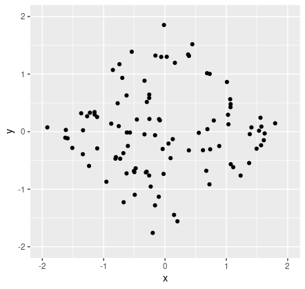
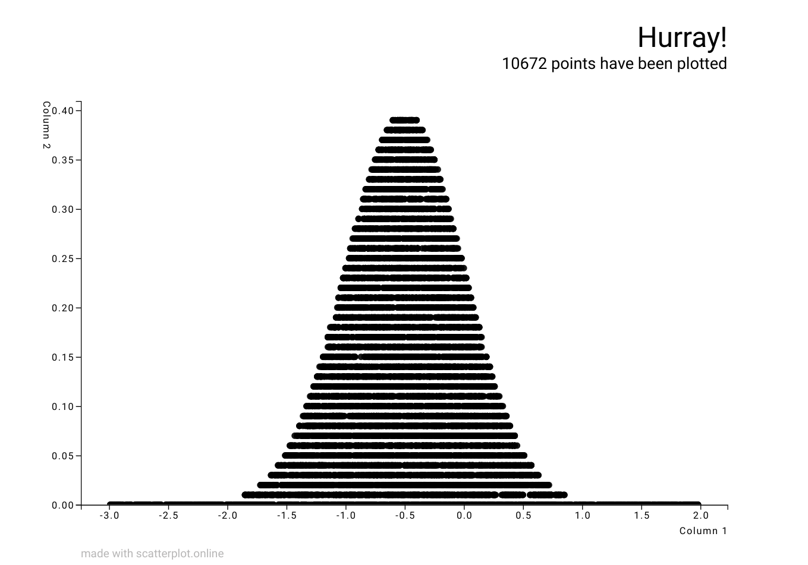

## GeomScaleTests

### 1. Easy

* Visualized sampling in a polytope.



### 2. Medium

* Implemented Accept-Reject Sampling in a gaussian curve.



### 3. Hard

* Implemented Metropolis Hasting algorithm to regenerate a curve.
* The sample points have been written to ```hard_output.csv```
